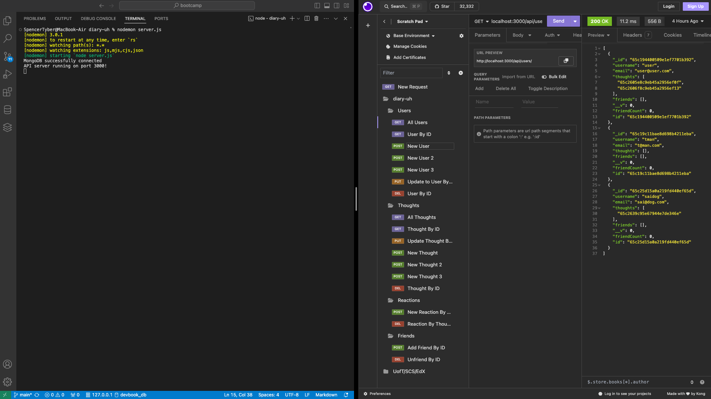

# diary-uh

A social networking API meant to demonstrate organizational skills involving databases, models, associations and routing which implements users, friend lists, thoughts (text posts), and reactions (text reactions to thoughts) to posts. 

## Description

An API built for social networks with a series of models and associations that are composed with the intention they be queried with a local HTTP request program like Insomnia or Postman in order to demonstrate functional usage of MongoDB, Mongoose and Express.

## Installation/Usage Demo Video

[Click here to watch the demo video](https://drive.google.com/file/d/1wINzPhB70Im7X-5DUgG6wXeUfd0hjXv9/view)

## Technologies

### Mongoose
### MongoDB
### Express
### Node.js
### JavaScript
### HTML
### CSS

## Credits & Sources

Information and documentation used in the creation of this app, but external to the EdX UofT Full-Stack Software Development Bootcamp including syntaxes, best practises and instructional examples for usage came from the following sources:

- https://www.mongodb.com/languages/express-mongodb-rest-api-tutorial
- https://www.mongodb.com/docs/manual/crud/
- https://mongoosejs.com/docs/guide.html

## License

See LICENSE file in repository
